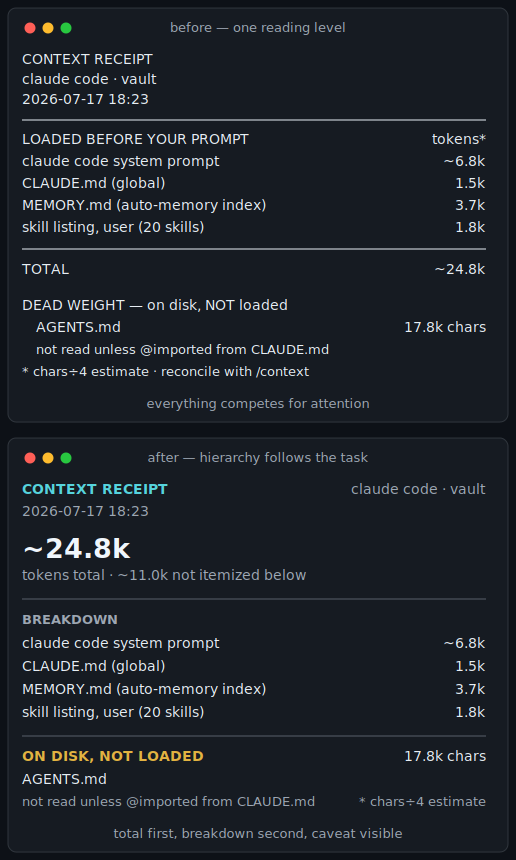

# glowup

**A design skill for the terminal**

CLI design isn't new. What's new is who can participate in it.

More designers are building, and more engineers can work directly with design
guidance. The terminal is becoming a shared product surface, but most reusable
design guidance still focuses on web and mobile.

glowup is a Claude Code skill for design engineers, designers who build, and
engineers who care about the experience of a CLI, developer tool, or agent
skill. It adapts established product-design principles to the people, agents,
and programs using the interface—without weakening the contracts they depend
on.

## Install

```bash
git clone https://github.com/katrinalaszlo/glowup ~/.claude/skills/glowup
```

If this creates `~/.claude/skills` for the first time, restart Claude Code.

## Usage

Open Claude Code in the project that contains your tool or skill, then run:

```text
/glowup
```

You can also ask Claude to “glowup my CLI,” “improve this tool's UX,” “glow up
this skill,” or “audit this skill's interaction design.”

For a terminal tool, glowup captures the real current experience and asks what
you want to improve: **Display**, **Flow**, or **Both**. It then shows the real
Before and a Proposed After using the same command and data before changing the
code. Once you approve the direction, it implements the change and verifies the
Final After without weakening machine contracts.

## What a run produces

For a CLI, the result is the same machine contracts with a clearer and more
useful human experience:



At the end, glowup can save a Markdown comparison with linked terminal captures
or screenshots. If the tool can run locally, it captures both states directly.
Otherwise, you can supply the starting screenshot or output.

For a skill, the before and after includes both the instruction change and its
effect on a representative request in a fresh session.

## What it considers

- **Look:** hierarchy, alignment, whitespace, color, and a layout that fits the
  information.
- **Feel:** first-run guidance, actionable errors, useful empty states, honest
  progress, and clear next steps.
- **Machine interface:** plain output when piped, unchanged `--json` and exit
  codes, and support for `NO_COLOR` and `--no-color`.
- **Skill experience:** discovery, progressive disclosure, useful questions,
  appropriate judgment, safety, validation, and context cost.

See a [worked before-and-after](references/example.md) with the exact code change,
or read the [terminal design principles and prior art](references/canon.md) behind
the CLI path and the [skill-design rubric](references/skill-design.md) for
human-agent collaboration.

## Roadmap

glowup starts with developer interfaces that can be tested against real tasks
and real before-and-afters. The same research will expand deliberately:

- **Now:** CLI and agent-skill design
- **Next:** human-agent workflow design
- **Exploring:** agent tool design for APIs, MCP, and function schemas

Accessibility, trust, documentation, and evaluation remain part of every stage.

## Help shape glowup

glowup should improve the way good products do: by learning from real use.

Share a [before and after](https://github.com/katrinalaszlo/glowup/issues/new?template=before-after.yml)
and share what you noticed—what worked, what didn't, or what you would
change. If you have a pattern, principle, or example that belongs in the skill,
fork the repository and open a pull request.

You don't need to be a designer. Experience from design, engineering, and
everywhere in between will make glowup better. You can also
[open a feedback issue](https://github.com/katrinalaszlo/glowup/issues/new?template=feedback.yml).

[MIT](LICENSE)
