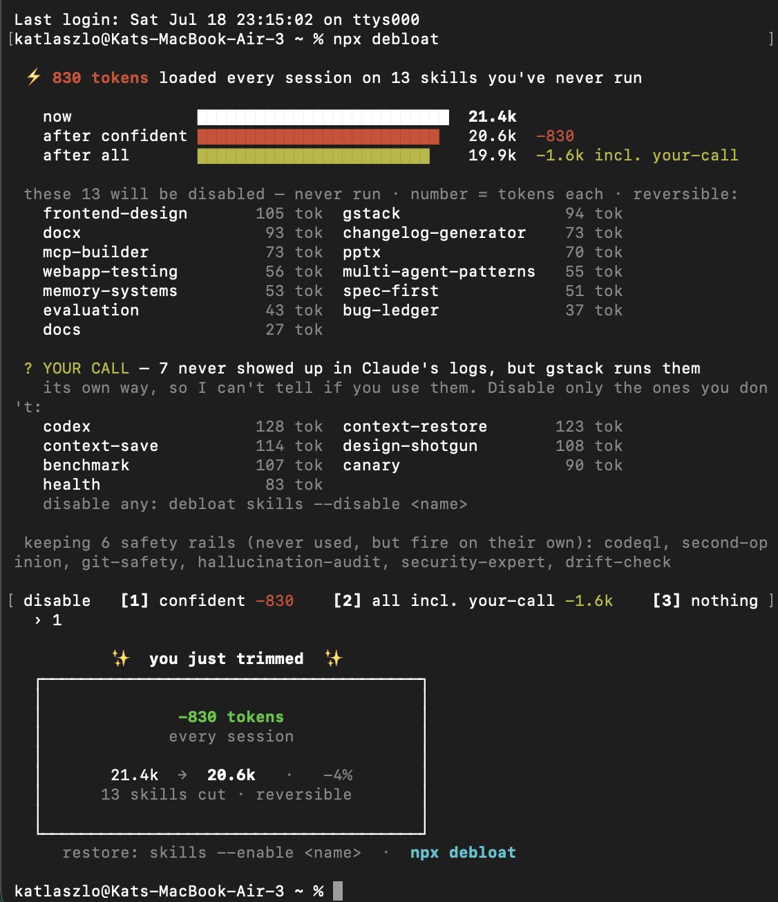
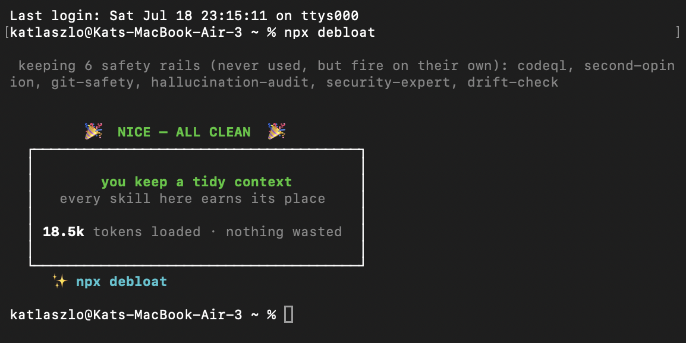

# Worked example: context-receipt (2026-07-17, the first glowup)

## Contents

- [Context-receipt: presentation-only pass](#context-receipt-presentation-only-pass)
- [npx debloat: interactive result](#npx-debloat-interactive-result)

Real before/after from the skill's first dogfood — a receipt-pattern CLI. Not mocked.

## Context-receipt: presentation-only pass

### Before (plain printf, no hierarchy — everything shouts equally)

```
 CONTEXT RECEIPT
 claude code · vault
 2026-07-17 18:23
 ──────────────────────────────────────────────
 LOADED BEFORE YOUR PROMPT             tokens*
 claude code system prompt               ~6.8k
 CLAUDE.md (global)                       1.5k
 MEMORY.md (auto-memory index)            3.7k
 skill listing, user (20 skills)          1.8k
 ──────────────────────────────────────────────
 TOTAL                                  ~24.8k

 DEAD WEIGHT — on disk, NOT loaded
   AGENTS.md                       17.8k chars
     not read by Claude Code unless @imported from CLAUDE.md
 * chars÷4 estimate · reconcile with /context
 npx context-receipt
```

### After (same bytes when piped; styled only for eyes)

Identical layout, plus hierarchy via whole-line styles:

- `CONTEXT RECEIPT` header → bold cyan (`1;36`) — the brand moment
- metadata, rules, column headers, notes, footer → dim (`2`) — they recede
- line items → plain — numbers own the middle ground
- `TOTAL` row → bold (`1`) — the hero; it's the number people compare
- `DEAD WEIGHT` header → yellow (`33`); its explanation lines → dim

The visual read order becomes: title → total → items → fine print. In the plain
version the read order was: everything at once.

Research note: the four visible rows sum to ~13.8k while the captured total is
~24.8k. The original styling pass preserved those bytes, but a complete UX pass should
label the remaining ~11.0k as unitemized or expose its components. Visual hierarchy must
not make an unexplained number look more trustworthy.

### The exact change that produced it

Presentation layer only — logic untouched. `--json` and piped stdout remained
byte-identical, and the over-budget path continued to return exit status 1.

```js
// was:
const line = (l, r = "") => console.log(" " + l.padEnd(W - r.length - 1) + r);
const rule = () => console.log(" " + "─".repeat(W));
line("CONTEXT RECEIPT");
line("TOTAL", "~" + fmt(total));

// became: pad first (plain), style the whole padded line after
const pad  = (l, r = "") => " " + l.padEnd(W - r.length - 1) + r;
const line = (l, r = "") => console.log(pad(l, r));
const lineS = (fn, l, r = "") => console.log(fn(pad(l, r)));
const rule = () => console.log(dim(" " + "─".repeat(W)));
lineS(accent, "CONTEXT RECEIPT");
lineS(bold, "TOTAL", "~" + fmt(total));
```

Note the trick: because styling wraps the *already-padded* line, ANSI codes never
touch the column math. No `visibleLength` needed anywhere in this glowup.

### Verification transcript (run these, expect these)

```
node cli.js | cat          # plain — no escape codes in piped output
node cli.js --json         # byte-identical to pre-glowup
node cli.js --budget 20000 # still exits 1 over budget
node cli.js --color        # forces styles, for screenshot capture in docs
NO_COLOR=1 node cli.js     # plain even on a TTY
```

## npx debloat: interactive result

Real run of `npx debloat`, where a priced choice resolves into a compact result:



What to pattern-match from it:

- **The result is distinct from the working table.** The ranked table supports the
  choice; the bordered box at the end (`-830 tokens · every session · 21.4k → 20.6k ·
  -4%`) consolidates the outcome.
- **Feedback is earned and specific.** The warm marker appears only after the user
  acted, the card's numbers are the same ones from the bars above, and `reversible`
  sits in the same breath as the result.
- **Color is semantic, and green is reserved.** White for now, red/olive for the two
  futures, dim for the table. Green appears once, on the earned result.
- **Choices are numbered with prices.** `[1] confident -830 · [2] all incl. your-call
  -1.6k · [3] nothing`. Every option states its cost, and "nothing" is a legitimate
  door.
- **Honest uncertainty, in the output.** The YOUR CALL section says these skills
  "never showed up in Claude's logs, but gstack runs them its own way, so I can't
  tell if you use them." The tool states the limits of its own telemetry instead of
  pretending to know.
- **Ends in a door, not a wall.** After the card, the restore command keeps undo one
  line away. The source command is retained because the tool's author intentionally
  chose it for this output; it is not a universal requirement.

And the same tool with nothing to trim:



- **The empty state is designed, not blank.** "Nothing to do" explains what was checked
  and why no action is needed: `you keep a tidy context · every skill here earns its
  place · 18.5k tokens loaded · nothing wasted`.
- **This is the reviewer with nothing to flag.** The praise lands because the same
  tool would have flagged bloat if it existed. Celebration from an honest system is
  calibrated to an actual result.
